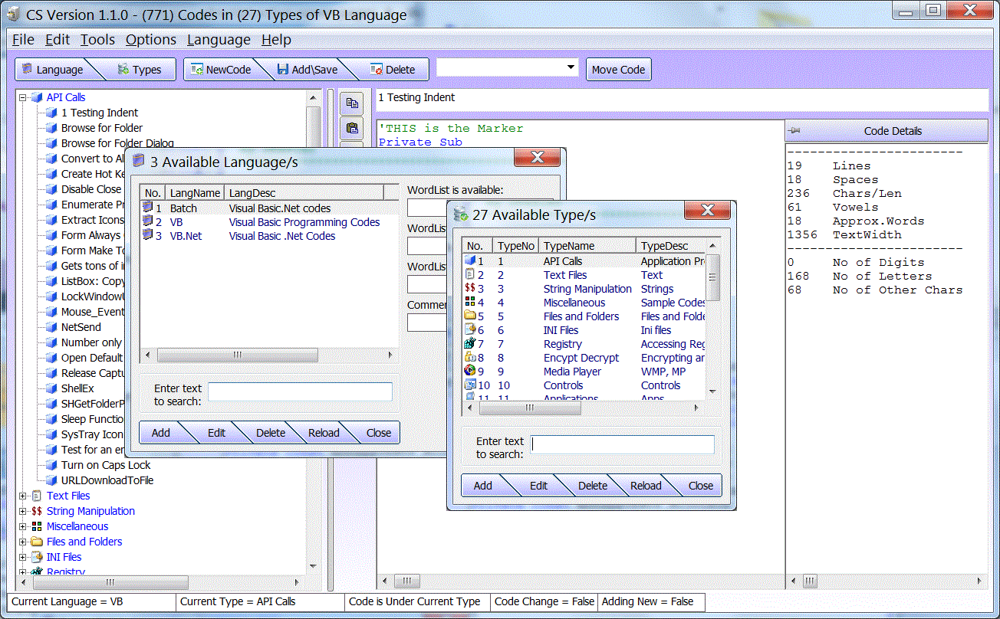



## Code Storage V1\.0\.1

### Description

Utility to store codes, types from different language, or even notes from batch, pc registry, access or excel programming, etc
 
### More Info
 

             |
---                |---
**Submitted On**   |2010-08-11 05:47:58
**By**             |[Daniel A\. Cadsawan Jr\.](https://github.com/Planet-Source-Code/PSCIndex/blob/master/ByAuthor/daniel-a-cadsawan-jr.md)
**Level**          |Intermediate
**User Rating**    |4.9 (34 globes from 7 users)
**Compatibility**  |VB 6\.0
**Category**       |[Complete Applications](https://github.com/Planet-Source-Code/PSCIndex/blob/master/ByCategory/complete-applications__1-27.md)
**World**          |[Visual Basic](https://github.com/Planet-Source-Code/PSCIndex/blob/master/ByWorld/visual-basic.md)
**Archive File**   |[Code\_Stora2186188132010\.zip](https://github.com/Planet-Source-Code/daniel-a-cadsawan-jr-code-storage-v1-0-1__1-73332/archive/master.zip)

